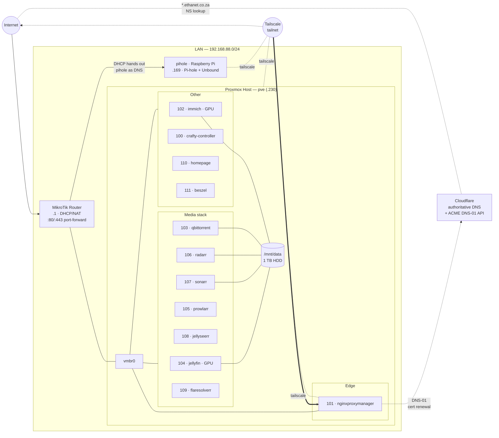
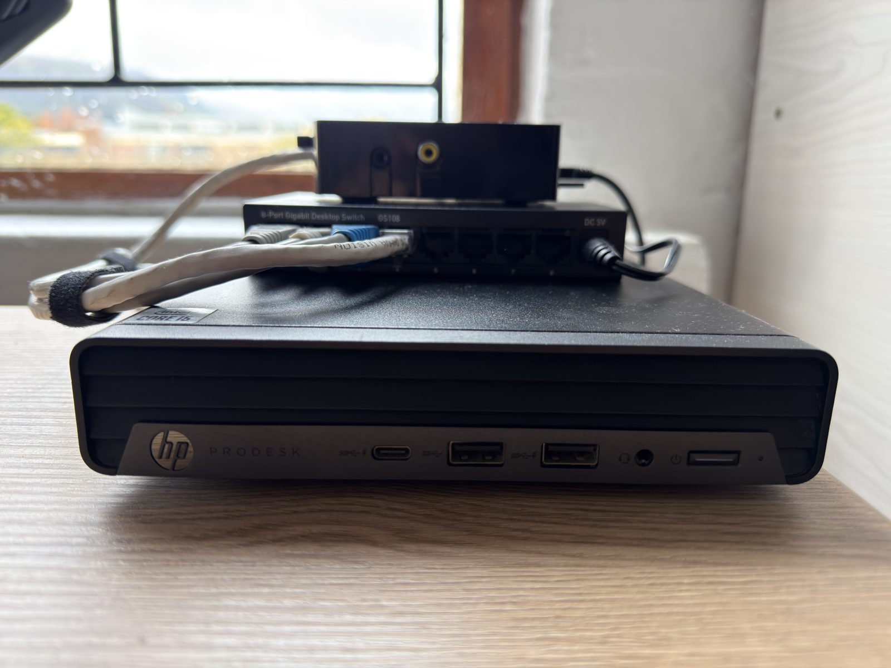
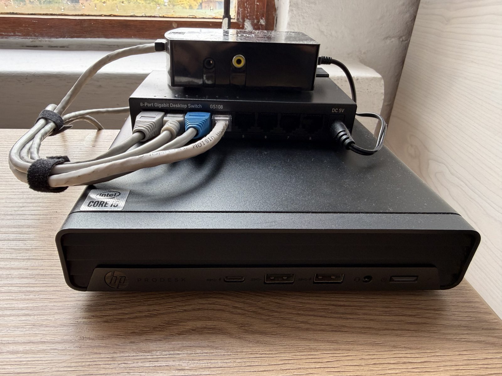
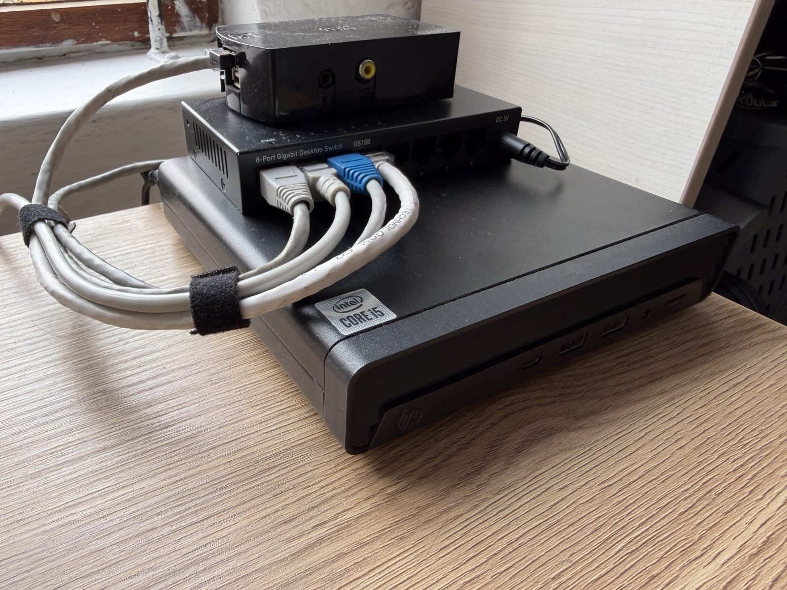

# Ethanet — A Single-Node Proxmox Homelab

A small homelab built around three ideas:

- **One small box, many isolated workloads.** A 35 W mini PC runs twelve
  unprivileged LXC containers — media, photos, game servers, monitoring,
  reverse proxy — without the overhead of full VMs.
- **Tailscale-only access — nothing is publicly exposed.** Every container
  joins my tailnet, and no ports on the router are forwarded to anything in
  the lab. Family and friends who use Jellyfin/Jellyseerr connect through
  Tailscale too. Nginx Proxy Manager isn't a public ingress — it sits
  inside the tailnet and turns LXC IPs into clean HTTPS URLs like
  `jellyfin.ethanet.co.za`, `requests.ethanet.co.za`, and so on. Cloudflare
  hosts authoritative DNS for the domain and provides the API NPM uses for
  Let's Encrypt DNS-01 challenges; it does **not** proxy traffic.
- **Filtered, recursive DNS at the edge.** A 2012 Raspberry Pi runs Pi-hole
  in front of a local Unbound resolver — every DNS query in the house gets
  ad-filtered and resolved from the root servers, never leaking to a public
  upstream.

Built and maintained by **Ethan Favis**. This repo is the documentation for
the lab — kept public as a reference and as a living artifact of what I've
built.

---

## At a glance

| | |
|---|---|
| **Host** | HP ProDesk 400 G6 Mini — Intel i5-10500T (6c/12t), 12 GB DDR4, 256 GB NVMe + 1 TB HDD |
| **Hypervisor** | Proxmox VE 9.1.6 (kernel 6.17.13-2-pve) |
| **Workloads** | 12 unprivileged LXC containers (no VMs) |
| **Networking** | MikroTik router (192.168.88.0/24) → single bridge `vmbr0` → Tailscale on every container |
| **External access** | Tailscale only — no port-forwards. NPM gives services clean HTTPS URLs (Let's Encrypt via Cloudflare DNS-01) |
| **DNS** | [Pi-hole + Unbound](docs/services/pi-hole.md) on a 2012 Raspberry Pi 1B — recursive, ad-filtering |
| **Remote access** | Tailscale (no port-forwards into the LAN) |
| **Monitoring** | Beszel agent on the host + per-container |
| **Backups** | Manual `vzdump` today; PBS planned *(see [docs/backups.md](docs/backups.md))* |
| **Provisioning** | [community-scripts.org](https://community-scripts.org) ProxmoxVE helper scripts |

---

## Topology

*Source: [`diagrams/network.mmd`](diagrams/network.mmd)*

---

## Services

All twelve containers are unprivileged LXCs with `nesting=1, keyctl=1`,
provisioned through the community-scripts ProxmoxVE helpers. Every container
runs `tailscaled` and is reachable on the tailnet without exposing the LAN.

| CTID | Service | Purpose | Cores | RAM | Disk | Notes |
|------|---------|---------|------:|----:|-----:|-------|
| 100 | [crafty-controller](docs/services/crafty-controller.md) | Minecraft server manager | 4 | 10 GB | 32 GB | Web UI on :8443 |
| 101 | [nginxproxymanager](docs/services/nginxproxymanager.md) | Reverse proxy / TLS | 2 | 2 GB | 8 GB | Tailnet-internal HTTPS |
| 102 | [immich](docs/services/immich.md) | Self-hosted photos | 4 | 6 GB | 20 GB + bind | GPU-accelerated ML |
| 103 | [qbittorrent](docs/services/qbittorrent.md) | BitTorrent client | 2 | 2 GB | 8 GB + bind | Bound to `/downloads` |
| 104 | [jellyfin](docs/services/jellyfin.md) | Media server | 2 | 4 GB | 16 GB + bind | Quick Sync transcode |
| 105 | [prowlarr](docs/services/prowlarr.md) | Indexer manager | 2 | 1 GB | 4 GB | Feeds the *arr stack |
| 106 | [radarr](docs/services/radarr.md) | Movie automation | 2 | 1 GB | 4 GB + bind | |
| 107 | [sonarr](docs/services/sonarr.md) | TV automation | 2 | 1 GB | 4 GB + bind | |
| 108 | [jellyseerr](docs/services/jellyseerr.md) | Request UI | 4 | 4 GB | 12 GB | Front door for users |
| 109 | [flaresolverr](docs/services/flaresolverr.md) | Cloudflare bypass | 2 | 2 GB | 4 GB | For Prowlarr |
| 110 | [homepage](docs/services/homepage.md) | Dashboard | 2 | 4 GB | 6 GB | Landing page |
| 111 | [beszel](docs/services/beszel.md) | Lightweight monitoring | 1 | 512 MB | 5 GB | Hub + agents |

Plus, off-host on a Raspberry Pi 1B:

| Host | Service | Purpose | RAM | Notes |
|------|---------|---------|----:|-------|
| `pihole` | [Pi-hole + Unbound](docs/services/pi-hole.md) | Network-wide ad filtering + recursive DNS | 512 MB | 2012 Raspberry Pi 1B, ARMv6 |

Total committed: **29 vCPU / 37.5 GB RAM** on a 6c/12t / 12 GB host —
oversubscribed on purpose; LXCs share the host kernel and idle very cheaply.

---

## Documentation

- **[docs/hardware.md](docs/hardware.md)** — full hardware inventory and rationale
- **[docs/network.md](docs/network.md)** — LAN, bridges, Tailscale, NPM, DNS
- **[docs/storage.md](docs/storage.md)** — NVMe / HDD layout, LVM-thin, bind mounts
- **[docs/backups.md](docs/backups.md)** — Proxmox Backup Server + retention
- **[docs/roadmap.md](docs/roadmap.md)** — what's next: PBS, off-site photo backup, IaC, clustering, more
- **[docs/services/](docs/services/)** — one page per LXC
- **[runbooks/](runbooks/)** — operational procedures (add LXC, restore, etc.)
- **[diagrams/](diagrams/)** — Mermaid sources for every diagram in this repo

---

## Design choices worth calling out

**LXC over VMs.** With 12 GB of RAM on the host, a dozen full VMs would be
painful. Unprivileged LXCs share the kernel, start in under a second, and let
me hand a single 1 TB HDD to multiple media services as a bind mount instead of
juggling per-VM virtual disks.

**Tailscale on every container, not just the host.** Each container gets
its own MagicDNS name and tailnet IP, so I can reach any service from my
laptop or phone over WireGuard with zero port-forwards on the LAN. Family
and friends who want Jellyfin/Jellyseerr access join the tailnet — there's
no public ingress to lock down because there isn't one in the first place.

**Hardware-accelerated transcoding into unprivileged containers.** The
`/dev/dri/renderD128` and `/dev/dri/card1` devices are passed into the
`immich` and `jellyfin` containers with the right GID mapping, so Quick Sync
works without dropping container privileges. See
[docs/services/jellyfin.md](docs/services/jellyfin.md) for the full config.

**Reverse proxy for clean HTTPS, not for public ingress.** NPM (101) lives
inside the tailnet and turns each LXC IP into a memorable HTTPS URL —
`jellyfin.ethanet.co.za`, `requests.ethanet.co.za`, etc. Wildcard certs
come from Let's Encrypt using DNS-01 challenges against Cloudflare (which
is authoritative for the domain). The router does **not** forward `:80`
or `:443` to NPM; the only way in from outside is Tailscale.

**Reproducible deploys.** Every container was provisioned via the
[community-scripts ProxmoxVE](https://github.com/community-scripts/ProxmoxVE)
helper scripts. The container IDs and configs in this repo are enough to
recreate the entire lab on a fresh Proxmox host.

---

## The hardware in the wild

**This is the entire lab.** Top to bottom on the desk: a Raspberry Pi 1 in
a case (running [Pi-hole + Unbound](docs/services/pi-hole.md)), a Cudy
GS108 8-port gigabit switch, and the HP ProDesk 400 G6 Mini that hosts
twelve LXC containers under Proxmox. A few patch cables tie the stack
together.

---

## License

Documentation: CC BY 4.0. Configuration snippets: MIT.
