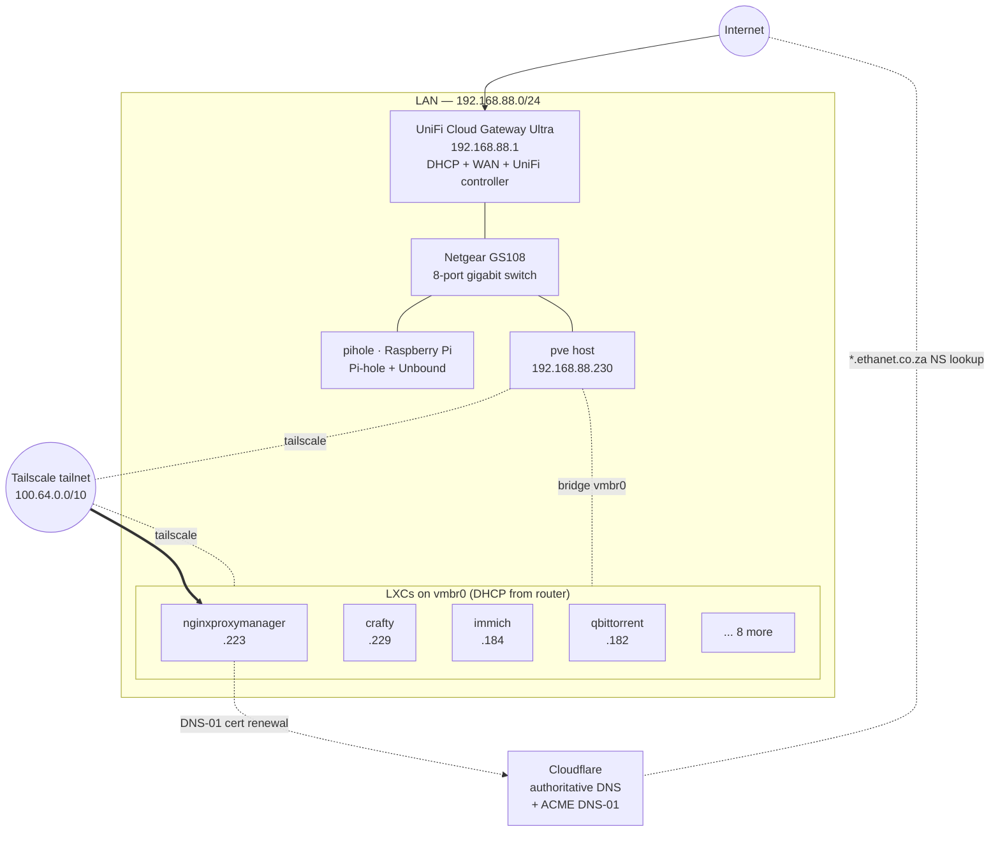

# Network



## LAN

- **Subnet:** `192.168.88.0/24`
- **Gateway / DHCP / NAT:** Ubiquiti **UniFi Cloud Gateway Ultra** (UCG-Ultra) at
  `192.168.88.1`. Replaced the previous MikroTik router; also runs the on-box
  **UniFi network controller** for the lab.
- **Switch:** Netgear GS108 — 8-port gigabit unmanaged switch sitting between the
  gateway and the rest of the lab — the Proxmox host and the Raspberry Pi both
  plug into it. *(Planned: replace with a UniFi PoE switch adopted into the UCG-Ultra controller.)*
- **DNS:** [`pihole`](services/pi-hole.md) (Raspberry Pi) — LAN clients use it via DHCP option
- **Proxmox host:** `pve` — `192.168.88.230` (static via interfaces file)

There are no VLANs. The lab is small enough that the cost of segmenting it
outweighs the benefit; trust is established at the application layer (NPM
auth, Tailscale ACLs).

## Proxmox bridge

The host's onboard NIC (`nic0`) is enslaved to a single Linux bridge `vmbr0`,
which all LXCs attach to. From `/etc/network/interfaces`:

```ini
auto lo
iface lo inet loopback

iface nic0 inet manual

auto vmbr0
iface vmbr0 inet static
    address 192.168.88.230/24
    gateway 192.168.88.1
    bridge-ports nic0
    bridge-stp off
    bridge-fd 0
```

Containers receive their LAN address via DHCP from the UCG-Ultra so leases are
visible in one place. Static-ish reservations are pinned by MAC.

## Tailscale

Every LXC and the host itself runs `tailscaled` (the LXCs use the standard
`/dev/net/tun` bind mount + `lxc.cgroup2.devices.allow: c 10:200 rwm`). Each
service is reachable by its MagicDNS name (`jellyfin`, `immich`, etc.) from any
of my devices on the tailnet, with no LAN port forwarding required.

The tailnet is the **only** external access path. Anyone who needs to use
Jellyfin or Jellyseerr (family, friends) joins the tailnet — there is no
public ingress.

## External access

**There is no public ingress.** The router does not forward `:80` or `:443`
(or anything else) to the lab. The only way to reach any service from
outside the LAN is Tailscale.

What NPM actually does for me:

- Cloudflare DNS for `*.ethanet.co.za` resolves subdomains like
  `jellyfin.ethanet.co.za` to NPM's address inside the tailnet/LAN.
- NPM (CT 101) terminates TLS for those subdomains using a wildcard cert
  from Let's Encrypt. Cert issuance and renewal use the **DNS-01**
  challenge against Cloudflare's API (NPM has the API token), so no
  inbound HTTP-01 traffic from public internet is needed.
- NPM proxies the request by `Host:` header to the matching LXC over the
  bridge in plain HTTP.

Net effect: I can hit `https://jellyfin.ethanet.co.za` from any device on
my tailnet, get a real cert, and never type an LXC IP. Anyone not on the
tailnet who tries the same URL just hits a tailnet-private address that
doesn't route — they can't see the lab at all.

## DNS

- **Public:** Cloudflare is authoritative for `ethanet.co.za`. All records
  for the lab's subdomains are managed there. Cloudflare also provides the
  API NPM uses for ACME DNS-01 cert renewals.
- **LAN:** Pi-hole on a Raspberry Pi, served via the router's DHCP options.
  Used for ad-blocking and local hostname overrides.
- **Tailnet:** MagicDNS is enabled, which gives each device a short name
  within the tailnet (`jellyfin`, `immich`, etc.) plus a long
  `<host>.tail-XXXXXX.ts.net` form.
