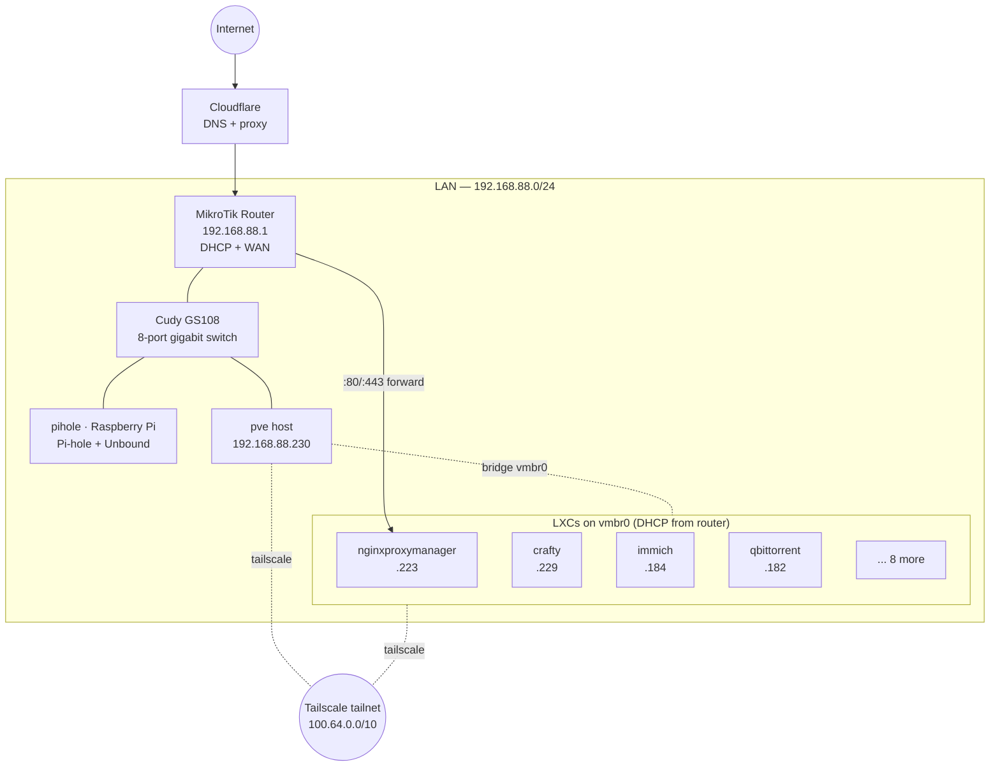

# Network



## LAN

- **Subnet:** `192.168.88.0/24`
- **Gateway / DHCP / NAT:** MikroTik router at `192.168.88.1`
- **Switch:** Cudy GS108 — 8-port gigabit unmanaged switch sitting between the router
  and the rest of the lab — the Proxmox host and the Raspberry Pi both plug
  into it.
- **DNS:** [`pihole`](services/pi-hole.md) (Raspberry Pi) — LAN clients use it via DHCP option
- **Proxmox host:** `pve` — `192.168.88.230` (static via interfaces file)

There are no VLANs. The lab is small enough that the cost of segmenting it
outweighs the benefit; trust is established at the application layer (NPM
auth, Tailscale ACLs).

## Proxmox bridge

The host's onboard NIC (`nic0`) is enslaved to a single Linux bridge `vmbr0`,
which all LXCs attach to. From `/etc/network/interfaces`:

```ini
auto lo
iface lo inet loopback

iface nic0 inet manual

auto vmbr0
iface vmbr0 inet static
    address 192.168.88.230/24
    gateway 192.168.88.1
    bridge-ports nic0
    bridge-stp off
    bridge-fd 0
```

Containers receive their LAN address via DHCP from the MikroTik so leases are
visible in one place. Static-ish reservations are pinned by MAC.

## Tailscale

Every LXC and the host itself runs `tailscaled` (the LXCs use the standard
`/dev/net/tun` bind mount + `lxc.cgroup2.devices.allow: c 10:200 rwm`). Each
service is reachable by its MagicDNS name (`jellyfin`, `immich`, etc.) from any
of my devices on the tailnet, with no LAN port forwarding required.

The tailnet is the **primary** access path. The public ingress through
Cloudflare/NPM exists only to share Jellyfin and Jellyseerr with people who
aren't on my tailnet.

## Public ingress

Cloudflare hosts the apex domain and proxies HTTP(S) traffic to the home IP.
The router forwards `:80` and `:443` to `192.168.88.223` (Nginx Proxy Manager,
CT 101), which terminates TLS using Let's Encrypt certs and proxies to the
appropriate container by hostname.

NPM also exposes its admin UI on `:81` — that one is **not** published; it's
only reachable on the LAN and over Tailscale.

## DNS

- **Public:** Cloudflare authoritative for the apex domain
- **LAN:** Pi-hole on a Raspberry Pi, served via the router's DHCP options.
  Used for ad-blocking and local hostname → tailnet IP overrides
- **Tailnet:** MagicDNS is enabled, which gives each device a name like
  `<host>.tail-XXXXXX.ts.net` and short names within the tailnet
