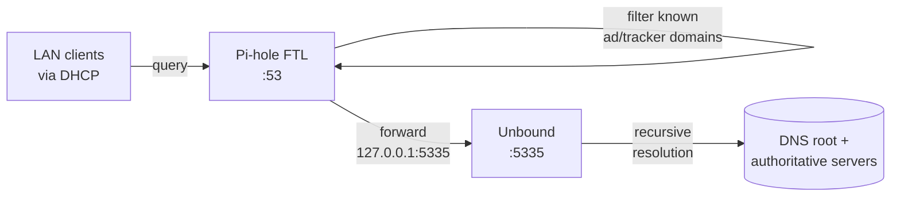

# Pi-hole + Unbound (Raspberry Pi)

Network-wide DNS filtering plus a fully recursive resolver — running on a
**Raspberry Pi Model B Rev 2** from 2012. Single ARMv6 core, 512 MB of RAM,
14 years on, still doing the most-queried job in the lab.

## Hardware

| | |
|---|---|
| Board | Raspberry Pi 1 Model B Rev 2 (BCM2835) |
| CPU | Single-core ARMv6 @ 700 MHz |
| RAM | 512 MB (~427 MB usable after GPU split) |
| Storage | 8 GB SD card (`/dev/mmcblk0`) |
| OS | Raspbian Bookworm — kernel 6.12.75 (`armv6l`) |
| Hostname | `pihole` |
| LAN | `192.168.88.169` (DHCP) |
| Tailnet | `pihole` |

## Services



| Service | Listens on | Purpose |
|---|---|---|
| `pihole-FTL` | `:53` (UDP+TCP) | Filtering DNS resolver — blocks ad/tracker domains via blocklists |
| `unbound` | `127.0.0.1:5335` | Recursive resolver — talks directly to root + authoritative servers |
| Pi-hole web UI | `:80` and `:443` | Admin / stats |
| `tailscaled` | tailnet | Remote management without exposing the LAN |

## Why Pi-hole → Unbound and not Pi-hole → 1.1.1.1

The standard "easy" Pi-hole install forwards upstream queries to a public
resolver (Cloudflare, Google, Quad9). That works, but it hands every domain
your network looks up to one company.

Adding **Unbound** locally turns the lab into its own recursive resolver:

- **Privacy:** queries don't leak to a third-party DNS provider.
- **No upstream rate limits** or DoH manipulation.
- **DNSSEC validation** end-to-end.
- **Cache locality** — repeated lookups never leave the LAN.

The Unbound config (`/etc/unbound/unbound.conf.d/pi-hole.conf`) hardens the
resolver in the obvious ways:

```conf
harden-glue: yes
harden-dnssec-stripped: yes
edns-buffer-size: 1232          # avoid fragmentation
prefetch: yes
private-address: 192.168.0.0/16  # DNS rebinding protection
private-address: 10.0.0.0/8
private-address: 172.16.0.0/12
# (and the IPv6 + link-local equivalents)
```

## How clients use it

The MikroTik router hands out the Pi's LAN IP as the DNS server via DHCP, so
every client on the LAN — phones, laptops, the Proxmox host, the LXCs —
filters through Pi-hole automatically. No per-device config required.

For devices on the tailnet but off-LAN (my phone when I'm out), the same Pi
is reachable as `pihole` over Tailscale and serves the same filtered, recursive
DNS — so ad-blocking follows me out of the house.

## Why a 2012 Pi 1B?

Because it's the cheapest device in the lab that's already paid for itself a
hundred times over. DNS is light — load average sits well under 1 — and a
single-core ARMv6 from 2012 is plenty for the query rate of one household.
Replacing it with anything newer would buy nothing for this workload, and
the more capable Pis are better used elsewhere (e.g. as the planned PBS
host).

## Upstream

- Pi-hole: <https://pi-hole.net/> · <https://github.com/pi-hole/pi-hole>
- Unbound: <https://nlnetlabs.nl/projects/unbound/about/>
- Pi-hole + Unbound guide: <https://docs.pi-hole.net/guides/dns/unbound/>
