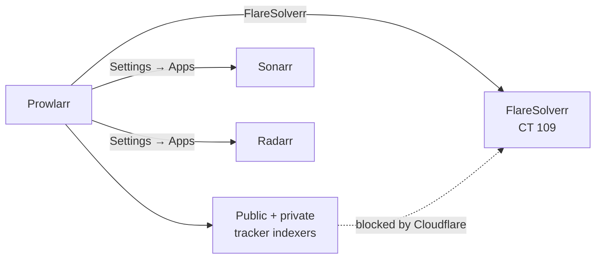

# Prowlarr (CT 105)

Central indexer manager for the *arr stack. Sonarr and Radarr ask Prowlarr,
not individual indexers — adding a new tracker is a one-place change.

## Container

| | |
|---|---|
| CTID | 105 |
| Hostname | `prowlarr` |
| OS | Debian 13 |
| Cores | 2 |
| Memory | 1 GB |
| Disk | 4 GB rootfs (no bind mounts) |
| Tailnet | `prowlarr` |

## What it talks to

FlareSolverr (CT 109) sits between Prowlarr and any indexer that hides behind
a Cloudflare challenge page; Prowlarr proxies the request through, gets a
real response back.

## Upstream

- Project: <https://prowlarr.com/>
- Source: <https://github.com/Prowlarr/Prowlarr>
- Install script: <https://community-scripts.org/scripts/prowlarr>
