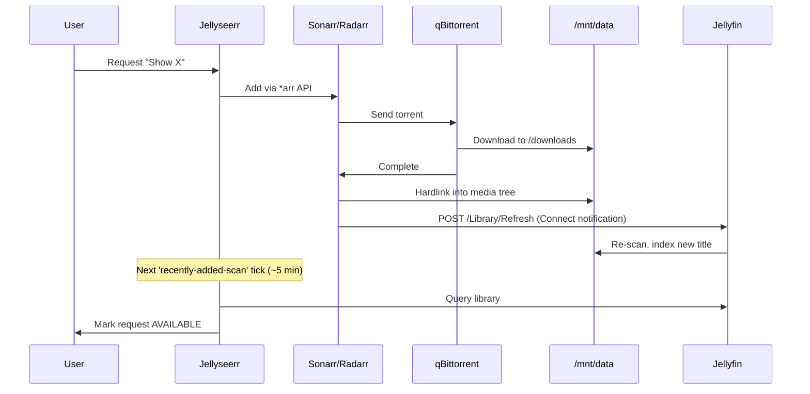
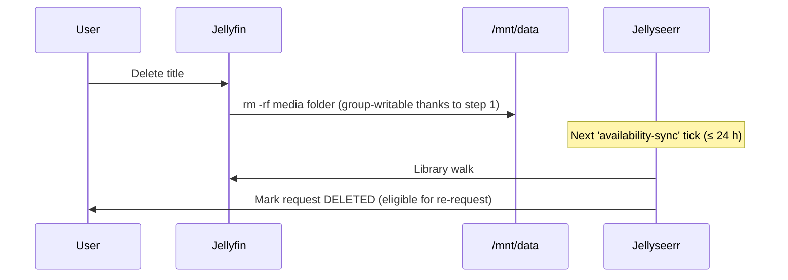

# Runbook: Keeping Jellyfin / Sonarr / Radarr / Jellyseerr in sync

The four apps each have their own view of the library. Three things need
to be true for them to stay aligned:

1. **Jellyfin must be able to write to the media tree.** Without this,
   deleting a movie or show from the Jellyfin UI silently fails.
2. **Sonarr and Radarr must tell Jellyfin to refresh** whenever they
   import, rename, or delete a file.
3. **Jellyseerr must periodically re-sync from Jellyfin** so its
   "available / partial / deleted" state reflects reality.

This runbook covers all three.

## 1. Jellyfin write access on `/mnt/data/jellyfin/media`

The bind mount lands in CT 104 as `/media`. Sonarr/Radarr/qBittorrent
write into it as `root` (UID 0 inside their containers, host UID 100000
under the unprivileged ID-shift). Jellyfin runs as user `jellyfin`
(UID 107) — without help, it can't delete root-owned files.

Fix, applied once inside CT 104:

```bash
usermod -aG root jellyfin
chmod -R g+rwX /media /config
find /media -type d -exec chmod g+s {} \;
systemctl restart jellyfin
```

The `g+s` (setgid) on directories means new files inherit the `root`
group. Combined with `g+rwX`, both Jellyfin and the *arr stack can
read/write/delete in the media tree.

## 2. Sonarr / Radarr → Jellyfin "library refresh" notification

Both *arr apps need a "Connect" / Notification entry pointing at Jellyfin
with **Update Library** enabled. Without this, Jellyfin only sees new
files when its own scheduled scan runs (every few hours by default).

In the UI: **Settings → Connect → + → Emby / Jellyfin**.

| Field | Value |
|---|---|
| Name | `Jellyfin` |
| Host | `100.75.208.39` (or `jellyfin` MagicDNS) |
| Port | `8096` |
| Use SSL | off |
| API Key | the Jellyfin API key (Dashboard → API Keys) |
| Update Library | **on** |
| Triggers | On Import, On Upgrade, On Rename, On Delete |

Or via API (substitute your own keys):

```bash
SONARR_KEY=...
RADARR_KEY=...
JELLYFIN_KEY=...

# Sonarr
curl -X POST -H "X-Api-Key: $SONARR_KEY" -H "Content-Type: application/json" \
  http://sonarr:8989/api/v3/notification \
  -d '{
    "name":"Jellyfin",
    "implementation":"MediaBrowser",
    "configContract":"MediaBrowserSettings",
    "onDownload":true,"onUpgrade":true,"onRename":true,
    "onImportComplete":true,"onSeriesDelete":true,
    "onEpisodeFileDelete":true,"onEpisodeFileDeleteForUpgrade":true,
    "fields":[
      {"name":"host","value":"jellyfin"},
      {"name":"port","value":8096},
      {"name":"useSsl","value":false},
      {"name":"apiKey","value":"'"$JELLYFIN_KEY"'"},
      {"name":"updateLibrary","value":true}
    ]
  }'
```

Radarr is identical except substitute `onSeriesDelete` →
`onMovieDelete` and `onEpisodeFileDelete*` → `onMovieFileDelete`,
and target `radarr:7878`.

## 3. Jellyseerr scheduled jobs

Out of the box, Jellyseerr runs:

| Job | Default cadence |
|---|---|
| `jellyfin-recently-added-scan` | every few minutes |
| `jellyfin-full-scan` | every 24 h |
| `radarr-scan` | every 24 h |
| `sonarr-scan` | every 24 h |
| `availability-sync` | every 24 h |

These are reasonable; verify in **Settings → Jobs & Cache**.

## 4. Cleaning up drift (when it happens)

Symptom: Seerr shows requests for media you've deleted in Jellyfin, or
shows "partial" for a series Sonarr says is 100% downloaded.

Quickest fix: **Settings → Jobs & Cache → Run Now** on
`Media Availability Sync`. That re-walks every Seerr media record
against Jellyfin and updates the state.

For orphan request rows (status `DELETED`), use the API:

```bash
KEY=...
# Find DELETED-state requests
curl -s -H "X-Api-Key: $KEY" http://seerr:5055/api/v1/request?take=200 \
  | jq -r '.results[] | select(.media.status==7) | "\(.id) \(.media.id)"'

# Delete request and underlying media record (lets you re-request later)
curl -X DELETE -H "X-Api-Key: $KEY" http://seerr:5055/api/v1/request/<req_id>
curl -X DELETE -H "X-Api-Key: $KEY" http://seerr:5055/api/v1/media/<media_id>
```

Deleting the media record is what unlocks re-requesting the same title
later — without it, Seerr remembers that the media existed and refuses a
fresh request.

## 5. End-to-end check

After everything's wired up, the round-trip should be:



Inverse flow (deletion):


